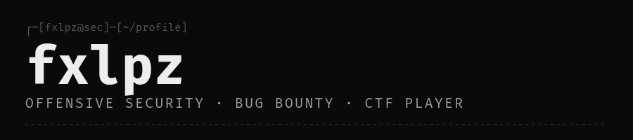
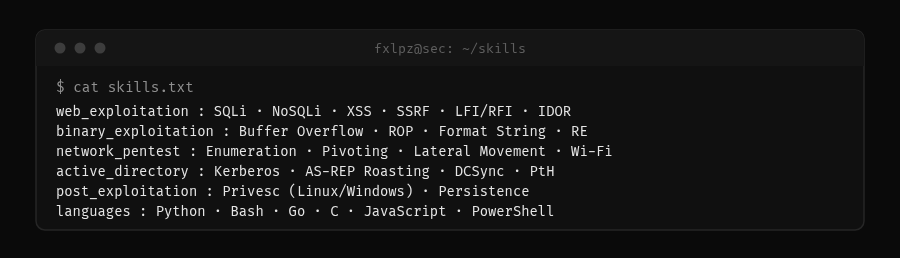
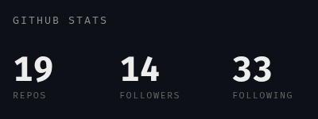
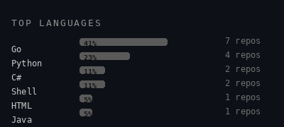
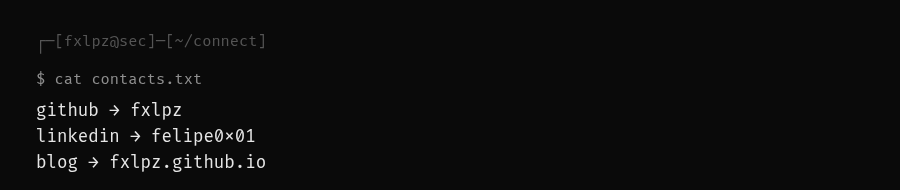

<p align="center">
  
</p>

> `$ whoami`
>
> offensive security specialist · bug bounty hunter · ctfer

## Overview

Offensive Security Specialist focused on vulnerability research and penetration testing. Passionate about breaking systems ethically to strengthen their security posture.

**Role:** CTF Player | Red Team Jr | Pentest Jr
**Age:** 23
**Mission:** Finding and exploiting vulnerabilities before malicious actors do

## Skills



## GitHub Stats

<p align="center">
  
  
</p>

## Security Arsenal

```text
reconnaissance      → nmap · masscan · gobuster · ffuf
web testing         → burp suite pro · owasp zap · sqlmap
exploitation        → metasploit · empire · cobalt strike
binary analysis     → ghidra · ida pro · radare2 · gdb
network analysis    → wireshark · tcpdump · responder
post-exploitation   → bloodhound · mimikatz · powersploit
```

## Methodology

```text
[1] RECONNAISSANCE    → gather intelligence on target systems
[2] SCANNING          → identify open ports and services
[3] ENUMERATION       → extract detailed system information
[4] EXPLOITATION      → gain unauthorized access
[5] POST-EXPLOITATION → maintain access and escalate privileges
[6] REPORTING         → document findings with remediation guidance
```

## Platforms

<p align="center">
  <a href="https://tryhackme.com/p/Fe1ps">
    
  </a>
  <a href="https://app.hackthebox.com/users/2483868">
    
  </a>
</p>

## Certificações

- **DCPT (Desec Security):** em andamento
- **TryHackMe / Hack The Box:** aprendizado contínuo via CTFs e boxes

## Contatos



- **GitHub:** [fxlpz](https://github.com/fxlpz)
- **LinkedIn:** [felipe0x01](https://www.linkedin.com/in/felipe0x01)
- **Blog:** [fxlpz.github.io](https://fxlpz.github.io)
- **Email:** [felipe.rosa.secdev@gmail.com](mailto:felipe.rosa.secdev@gmail.com)
- **TryHackMe:** [Fe1ps](https://tryhackme.com/p/Fe1ps)
- **Hack The Box:** [fxlpz](https://app.hackthebox.com/users/2483868)

---

<p align="center">
  <code>hack the planet, secure the future</code>
</p>


